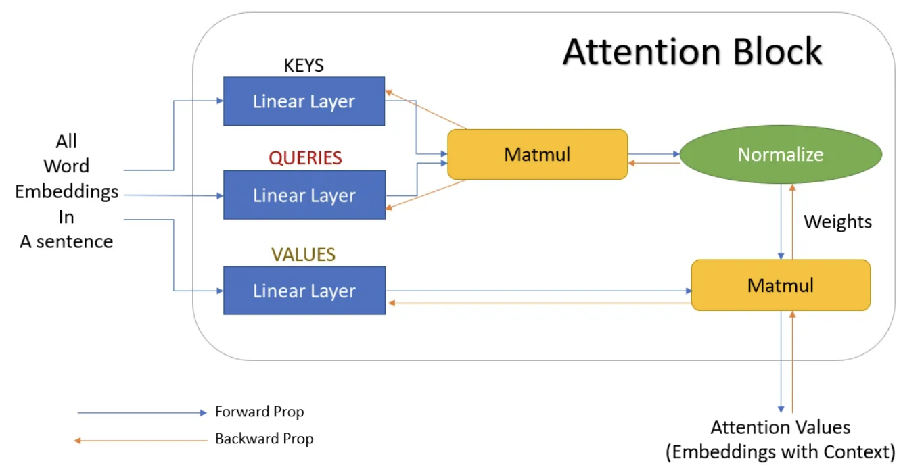
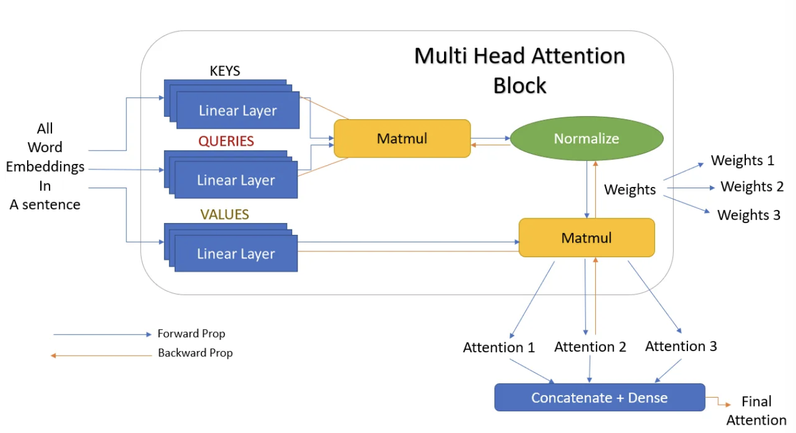
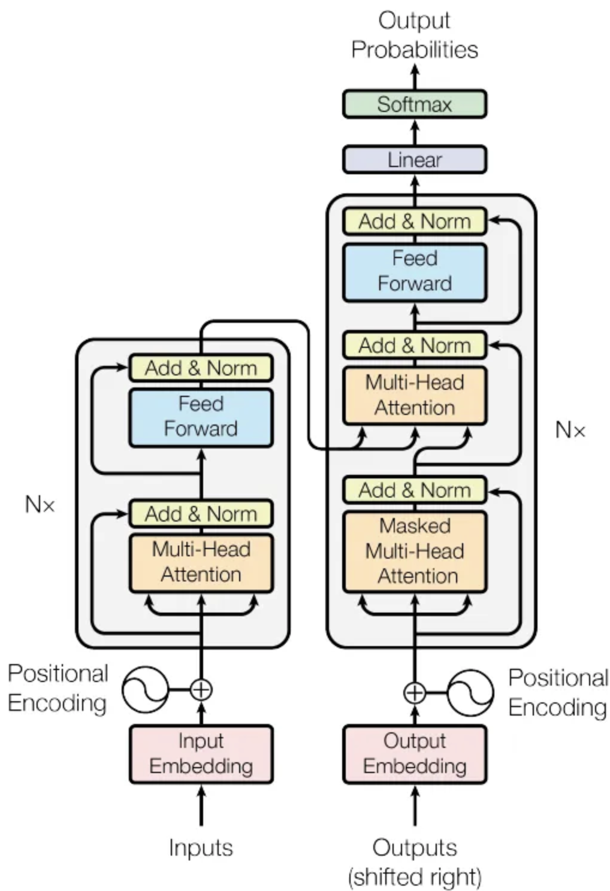
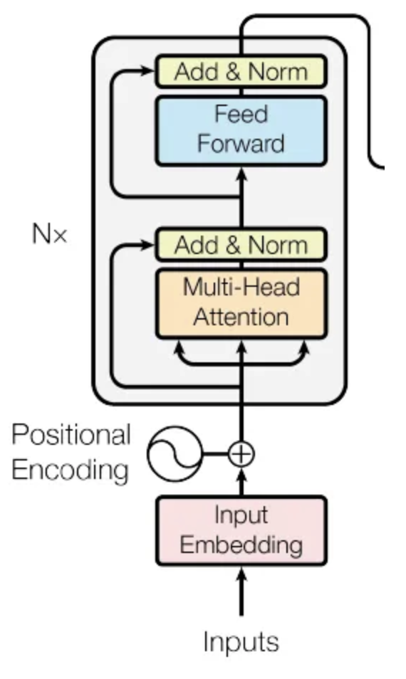
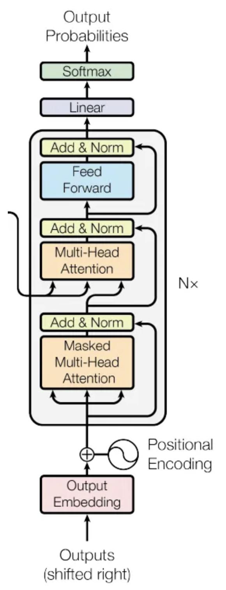

## The Attention Mechanism

### Self-Attention

We first split the input into tokens $t$ (e.g. words), then this tokens have word embeddings $V$. The thing is that this embeddings have no context. So the idea is to apply some kind of weights or similarity to obtain a final word embedding $Y$, which has more context that the original embedding.

In order to calculate the weights we just normalize the dot products of each two of the original word embeddings ($W_{i, j} = V_i \cdot V_j$). And to obtain the new embeddings we do: $Y_i = W_{i, 1} \cdot V_1 + \dots + W_{i, n} \cdot V_n$, where $n$ is the number of tokens of the sequence.

The interesting thing is that weights are not trained and that the proximity of words is of no influence. Also, the process has no dependency on the length of the sentence.

### Query, Key, and Values

As Self-Attention isn't trained, we can try adding trainable parameters in order to get a much better context.
In the calculation process, we use $V$ three times on the calculation of $Y$, so we will replace all the 3 $V$'s by **Query**, **Keys**, and **Values**.

The thing is to add 3 matrices of trainable parameters $Mq$, $Mk$ and $Mv$, that are multiplied by query, keys and values during the calculation of the new embeddings. e.g. $W_{i, j} = (Mq  V_i) \cdot (Mk V_j)$, and after normalizing $W_{i, j}$, we have $Y_i = W_{i, 1} \cdot (Mv V_1) + \dots + W_{i, n} \cdot (Mv V_n)$.

$attention(q, k, v) = \sum_{i} similarity(q, k_i) \cdot v_i$

### Neural network representation of Attention

We can add more than one attention block to provide more context.
Also, we can use back propagation to update the attention block.

### Multi-Head Attention

## The Transformer Network

The network contains two parts the **encoder** and the **decoder**.

### The Encoder Blocks

- **Input embedding**: Converting a word into a vector representation.
- **Positional encoding**: Vector that gives information based on the context and position of the word in the sentence. There are multiple ways of defining these positional embeddings. (Can be fixed or learned during training).
- **Multi-Head Attention**
- **Add & Norm and Feed-Forward**:
  - **Add & Norm**: takes in a residual connection to the original word embeddings, adds it to the embedding from the multi-head attention, and then normalizes to mean 0 and variance 1.
  - **Feed-Forward** also has a _Add & Norm_ block at its output.

The whole multi-head attention and feed forward blocks are repeated $n$ times in the encoder block.

### The Decoder blocks

The goal of the decoder is to produce some output.
It has a new block: _Masked Multi-Head Attention_.

#### Masked Multi-Head Attention

This is a multi-head attention block where some values are masked. The probabilities of the masked values are nullified or not selected.

$MaskedAttention(Q, K, V) = SoftMax(\frac{Q^T K + M}{\sqrt{d_k}})V$
where $M$ is a mask matrix of zeros and $-\infty$.
